#+title: Matemáticas II
#+REVEAL_MARGIN: 0.05
#+REVEAL_TITLE_SLIDE: <h1>%t</h1>
#+OPTIONS: toc:nil

* Tema 1: Límites y continuidad
** Ejercicio
#+REVEAL_HTML: 

#+ATTR_HTML: :width 100%
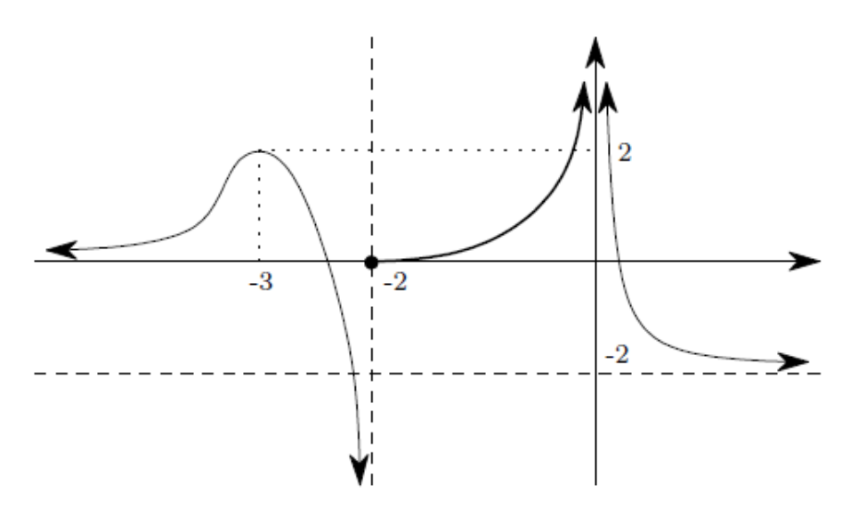

- $\displaystyle\lim_{ {x} \rightarrow {-\infty} } {f}$
- $\displaystyle\lim_{ {x} \rightarrow {-3} } {f}$
- $\displaystyle\lim_{ {x} \rightarrow {-2^-} } {f}$
#+REVEAL_HTML: 

- $\displaystyle\lim_{ {x} \rightarrow {-2^+} } {f}$
- $\displaystyle\lim_{ {x} \rightarrow {-2} } {f}$
- $\displaystyle\lim_{ {x} \rightarrow {0} } {f}$
- $\displaystyle\lim_{ {x} \rightarrow {\infty} } {f}$
#+REVEAL_HTML: 

#+REVEAL_HTML: 

** Ejercicio

Dibuja la gráfica de una función $f$ tal que:

$$\begin{array}{|l|l|l|} \hline
\text{dom }f=\mathbb{R}-(-2,2)&\displaystyle\lim_{ {x} \rightarrow {-4} } {f}=-3&f(-2)=f(2)=0\\ \hline
\displaystyle\lim_{ {x} \rightarrow {-\infty} } {f}=\infty&f(-4)=-2&\displaystyle\lim_{ {x} \rightarrow {\infty} } {f}=-2\\ \hline\end{array}$$

** Ejercicio

#+REVEAL_HTML: 

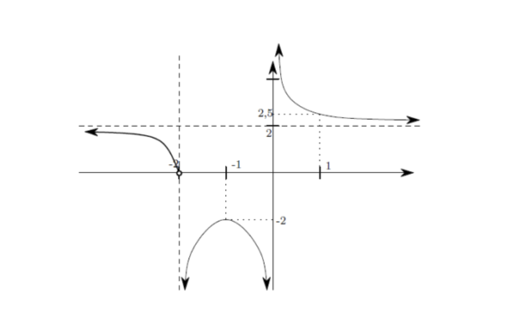

- $\displaystyle\lim_{ {x} \rightarrow {-\infty} } {f}$
- $\displaystyle\lim_{ {x} \rightarrow {-2} } {f}$
- $\displaystyle\lim_{ {x} \rightarrow {-1} } {f}$
#+REVEAL_HTML: 

- $\displaystyle\lim_{ {x} \rightarrow {0} } {f}$
- $\displaystyle\lim_{ {x} \rightarrow {1} } {f}$
- $\displaystyle\lim_{ {x} \rightarrow {\infty} } {f}$
#+REVEAL_HTML: 

#+REVEAL_HTML: 

** Ejercicio

#+REVEAL_HTML: 

#+ATTR_HTML: :width 100%
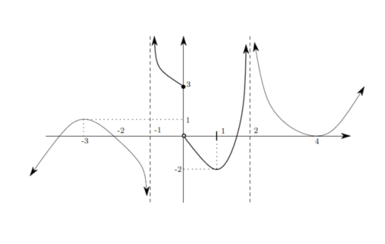

- $\displaystyle\lim_{ {x} \rightarrow {-\infty} } {g}$
- $\displaystyle\lim_{ {x} \rightarrow {-3} } {g}$
- $\displaystyle\lim_{ {x} \rightarrow {-1} } {g}$
- $\displaystyle\lim_{ {x} \rightarrow {0} } {g}$
#+REVEAL_HTML: 

- $\displaystyle\lim_{ {x} \rightarrow {1} } {g}$
- $\displaystyle\lim_{ {x} \rightarrow {2} } {g}$
- $\displaystyle\lim_{ {x} \rightarrow {\infty} } {g}$
#+REVEAL_HTML: 

#+REVEAL_HTML: 

** Ejercicio

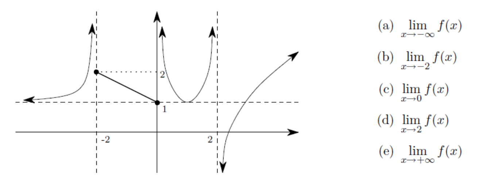

** Ejercicio

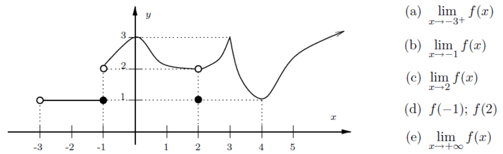

** Ejercicio

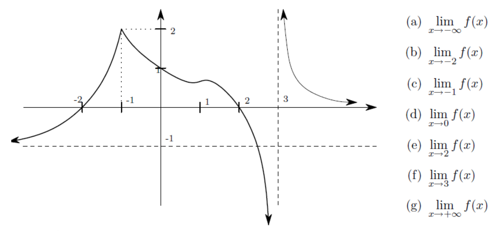

** Ejercicio

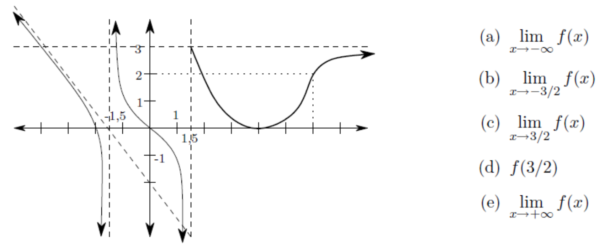

** Ejercicio

** Ejercicio

Dibuja la gráfica de una función $f$ tal que:

$$\begin{array}{|l|l|l|} \hline
\text{dom }f=\mathbb{R}-(-2,2)&\displaystyle\lim_{ {x} \rightarrow {-4} } {f}=-3&f(-2)=f(2)=0\\ \hline
\displaystyle\lim_{ {x} \rightarrow {-\infty} } {f}=\infty&f(-4)=-2&\displaystyle\lim_{ {x} \rightarrow {\infty} } {f}=-2\\ \hline\end{array}$$

** Ejercicio

Dibuja la gráfica de una función $f$ tal que:

$$\begin{array}{|l|l|l|} \hline
\text{dom }h=\mathbb{R}-\{-2,2\}&h(-3)=1&\displaystyle\lim_{ {x} \rightarrow {2^-} } {h}=-\infty\\ \hline
\displaystyle\lim_{ {x} \rightarrow {-\infty} } {h}=-\infty&\displaystyle\lim_{ {x} \rightarrow {-2^-} } {h}=-\infty&\displaystyle\lim_{ {x} \rightarrow {2^+} } {h}=\infty\\ \hline
\displaystyle\lim_{ {x} \rightarrow {-3} } {h}=-2&\displaystyle\lim_{ {x} \rightarrow {-2^+} } {h}=\infty&\displaystyle\lim_{ {x} \rightarrow {\infty} } {h}=\infty\\ \hline\end{array}$$

** Ejercicio

Dibuja la gráfica de una función $f$ tal que:

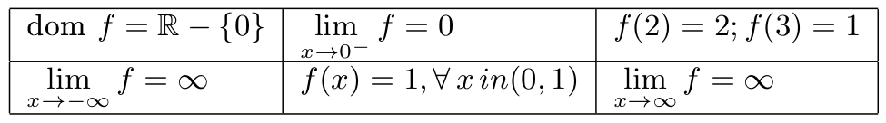

** Ejercicio

Dibuja la gráfica de una función $f$ tal que:

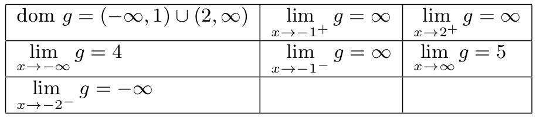

** Ejercicio

Dibuja la gráfica de una función $f$ tal que:

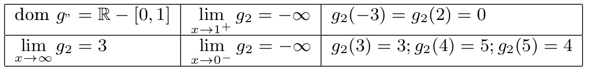

** Ejercicio

Dibuja la gráfica de una función $f$ tal que:

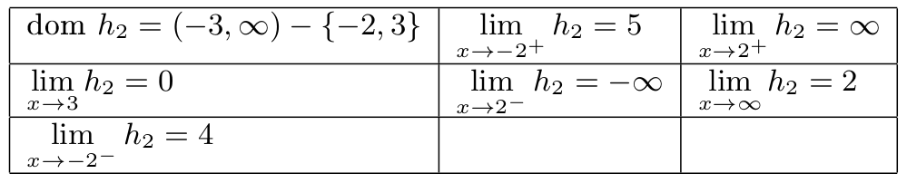

** Ejercicio

Dibuja la gráfica de una función $f$ tal que:

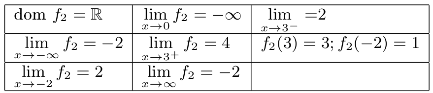

** Ejercicio

Dibuja la gráfica de una función $f$ tal que:

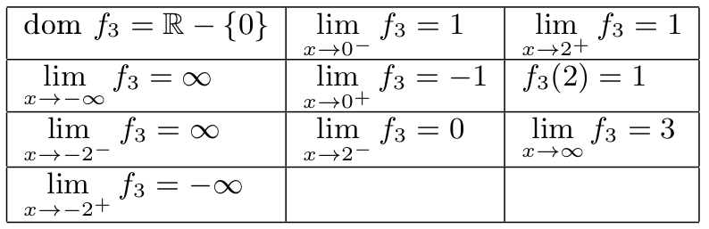

** Ejercicio

Sea $f$ una función de la que se sabe que:

- $\text{dom} f =\mathbb{R}$;
- $f(1)=0$;
- $\displaystyle\lim_{ {x} \rightarrow {1^-} } {f} = \infty$; $\displaystyle\lim_{ {x} \rightarrow {1^+} } {f}=-\infty$; y,
- $\displaystyle\lim_{ {x} \rightarrow {-\infty} } {f}=\displaystyle\lim_{ {x} \rightarrow {\infty} } {f}=2$.

  a. Determine razonadamente o discuta la inexistencia del límite siguiente: $\displaystyle\lim_{ {x} \rightarrow {1} } {f^2}$.
  b. Calcule $\displaystyle\lim_{ {x} \rightarrow {1} } {(f \circ f)}$ (sugerencia: calcule primero los límites laterales).

** Ejercicio

$\text{dom} f =\mathbb{R}$; $f(1)=0$; $\displaystyle\lim_{ {x} \rightarrow {1^-} } {f} = \infty$; $\displaystyle\lim_{ {x} \rightarrow {1^+} } {f}=-\infty$; y, $\displaystyle\lim_{ {x} \rightarrow {-\infty} } {f}=\displaystyle\lim_{ {x} \rightarrow {\infty} } {f}=2$.
a. Determine razonadamente o discuta la inexistencia del límite siguiente: $\displaystyle\lim_{ {x} \rightarrow {1} } {f^2}$.
b. Calcule $\displaystyle\lim_{ {x} \rightarrow {1} } {(f \circ f)}$ (sugerencia: calcule primero los límites laterales).
