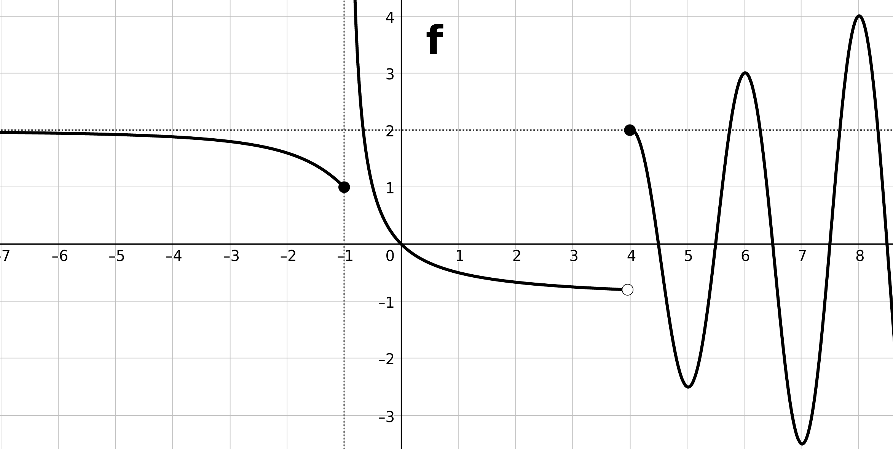
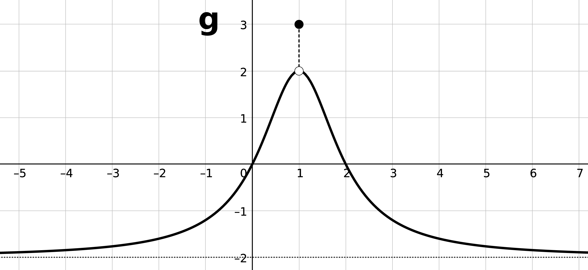

#+title: Matemáticas II
#+REVEAL_ROOT: https://cdn.jsdelivr.net/npm/reveal.js
#+REVEAL_MARGIN: 0.05
#+REVEAL_TITLE_SLIDE:
#+REVEAL_HLEVEL: 2
#+OPTIONS: toc:nil
#+startup: num
#+MY_OFFSET: 0
#+LATEX_CLASS: article
#+LATEX_CLASS_OPTIONS: [10pt, a4paper]
#+LATEX_HEADER: \usepackage[T1]{fontenc}
#+LATEX_HEADER: \usepackage[utf8]{inputenc}
#+LATEX_HEADER: \usepackage[a4paper]{geometry}
#+LATEX_HEADER: \geometry{verbose, tmargin=1.5cm, bmargin=1.5cm, lmargin=1.5cm, rmargin=1.5cm}
#+AUTHOR: Departamento de Matemáticas

* Límites y continuidad
** Ejemplo
:PROPERTIES:
:ID:       a4f2fc71-59e7-4eb2-b45e-1c5fa1e4e870
:END:
#+REVEAL_HTML: 

#+ATTR_HTML: :width 100%
[[./_img/ejercicio001g.png]]

- $\displaystyle\lim_{ {x} \rightarrow {-\infty} } {f}$
- $\displaystyle\lim_{ {x} \rightarrow {-3} } {f}$
- $\displaystyle\lim_{ {x} \rightarrow {-2^-} } {f}$
#+REVEAL_HTML: 

- $\displaystyle\lim_{ {x} \rightarrow {-2^+} } {f}$
- $\displaystyle\lim_{ {x} \rightarrow {-2} } {f}$
- $\displaystyle\lim_{ {x} \rightarrow {0} } {f}$
- $\displaystyle\lim_{ {x} \rightarrow {\infty} } {f}$
#+REVEAL_HTML: 

#+REVEAL_HTML: 

** Ejemplo
:PROPERTIES:
:ID:       d5298127-9333-4d5e-87cc-c11c8ffe24b2
:END:

Dibuja la gráfica de una función $f$ tal que:

$$\begin{array}{|l|l|} \hline
\text{dom }f=\mathbb{R}-(-2,2)&\displaystyle\lim_{ {x} \rightarrow {-4} } {f}=-3 \\ \hline f(-2)=f(2)=0 & \displaystyle\lim_{ {x} \rightarrow {-\infty} } {f}=\infty \\ \hline f(-4)=-2 & \displaystyle\lim_{ {x} \rightarrow {\infty} } {f}=-2  \\ \hline\end{array}$$

** Tareas
:PROPERTIES:
:UNNUMBERED: t
:ID:       ba24118b-8d4f-4c35-8481-20fe9e3e6004
:END:
- Estudiar:
  - Concepto de límite finito o infinito (en un punto, laterales, en el infinito).
  - Teorema de existencia del límite.
- Encuentra un ejemplo de que cada uno de los tipos de límite (finito en un punto, infinito en un punto, no exitente en un punto, lateral finito, lateral infinito,...).
- Ejercicios: [[id:06125781-3834-403d-abb5-065afc25e265][1.3]] - [[id:1b76ff04-e2a0-4a22-a649-50bf5d2a27e8][1.15]]

** Ejercicio
:PROPERTIES:
:ID:       06125781-3834-403d-abb5-065afc25e265
:END:

#+REVEAL_HTML: 

[[./_img/ejercicio0001a.png]]

- $\displaystyle\lim_{ {x} \rightarrow {-\infty} } {f}$
- $\displaystyle\lim_{ {x} \rightarrow {-2} } {f}$
- $\displaystyle\lim_{ {x} \rightarrow {-1} } {f}$
#+REVEAL_HTML: 

- $\displaystyle\lim_{ {x} \rightarrow {0} } {f}$
- $\displaystyle\lim_{ {x} \rightarrow {1} } {f}$
- $\displaystyle\lim_{ {x} \rightarrow {\infty} } {f}$
#+REVEAL_HTML: 

#+REVEAL_HTML: 

** Ejercicio
:PROPERTIES:
:ID:       d79cee04-4b57-4853-8e11-bd2ce33d933a
:END:

#+REVEAL_HTML: 

#+ATTR_HTML: :width 100%
[[./_img/ejercicio0001b.png]]

- $\displaystyle\lim_{ {x} \rightarrow {-\infty} } {g}$
- $\displaystyle\lim_{ {x} \rightarrow {-3} } {g}$
- $\displaystyle\lim_{ {x} \rightarrow {-1} } {g}$
- $\displaystyle\lim_{ {x} \rightarrow {0} } {g}$
#+REVEAL_HTML: 

- $\displaystyle\lim_{ {x} \rightarrow {1} } {g}$
- $\displaystyle\lim_{ {x} \rightarrow {2} } {g}$
- $\displaystyle\lim_{ {x} \rightarrow {\infty} } {g}$
#+REVEAL_HTML: 

#+REVEAL_HTML: 

** Ejercicio
:PROPERTIES:
:ID:       a8bf6aa6-8eb1-493c-bd48-b738b930ef31
:END:

[[./_img/ejercicio001c.png]]

** Ejercicio
:PROPERTIES:
:ID:       941c6b9c-3ea7-4a6a-8102-3581396707f8
:END:

[[./_img/ejercicio001d.png]]

** Ejercicio
:PROPERTIES:
:ID:       7309bc03-0443-4420-828b-a3d48a56df1a
:END:

[[./_img/ejercicio001e.png]]

** Ejercicio
:PROPERTIES:
:ID:       41450793-1a8d-4393-884d-bcd6784b9ede
:END:

[[./_img/ejercicio001f.png]]

** Ejercicio
:PROPERTIES:
:ID:       014aa537-b7eb-4db7-b054-5a907bcfd7a4
:END:

Dibuja la gráfica de una función $f$ tal que:

$$\begin{array}{|l|l|l|} \hline
\text{dom }h=\mathbb{R}-\{-2,2\}&h(-3)=1&\displaystyle\lim_{ {x} \rightarrow {2^-} } {h}=-\infty\\ \hline
\displaystyle\lim_{ {x} \rightarrow {-\infty} } {h}=-\infty&\displaystyle\lim_{ {x} \rightarrow {-2^-} } {h}=-\infty&\displaystyle\lim_{ {x} \rightarrow {2^+} } {h}=\infty\\ \hline
\displaystyle\lim_{ {x} \rightarrow {-3} } {h}=-2&\displaystyle\lim_{ {x} \rightarrow {-2^+} } {h}=\infty&\displaystyle\lim_{ {x} \rightarrow {\infty} } {h}=\infty\\ \hline\end{array}$$

** Ejercicio
:PROPERTIES:
:ID:       224d55c7-6750-4a79-9294-9909e1df1baf
:END:

Dibuja la gráfica de una función $f$ tal que:

[[./_img/ejercicio002b.png]]

** Ejercicio
:PROPERTIES:
:ID:       9287fe7b-9d09-4c9e-958b-2b6526ee6731
:END:

Dibuja la gráfica de una función $f$ tal que:

[[./_img/ejercicio002c.png]]

** Ejercicio
:PROPERTIES:
:ID:       831f099a-5dfc-40f2-b9f3-780837cd91e9
:END:

Dibuja la gráfica de una función $f$ tal que:

[[./_img/ejercicio002e.png]]

** Ejercicio
:PROPERTIES:
:ID:       35230f46-7355-4879-9189-3a8fac0059cb
:END:

Dibuja la gráfica de una función $f$ tal que:

[[./_img/ejercicio002f.png]]

** Ejercicio
:PROPERTIES:
:ID:       3effb17c-7045-4ba4-a8ab-b66ee69b0ed2
:END:

Dibuja la gráfica de una función $f$ tal que:

[[./_img/ejercicio002g.png]]

** Ejercicio
:PROPERTIES:
:ID:       1b76ff04-e2a0-4a22-a649-50bf5d2a27e8
:END:

Dibuja la gráfica de una función $f$ tal que:

[[./_img/ejercicio002h.png]]

** Ejemplo
:PROPERTIES:
:ID:       5e1e2059-3826-404d-a941-897867bdfa66
:END:

Sea $f$ una función de la que se sabe que:

- $\text{dom} f =\mathbb{R}$;
- $f(1)=0$;
- $\displaystyle\lim_{ {x} \rightarrow {1^-} } {f} = \infty$; $\displaystyle\lim_{ {x} \rightarrow {1^+} } {f}=-\infty$; y,
- $\displaystyle\lim_{ {x} \rightarrow {-\infty} } {f}=\displaystyle\lim_{ {x} \rightarrow {\infty} } {f}=2$.

  a. Determine razonadamente o discuta la inexistencia del límite siguiente: $\displaystyle\lim_{ {x} \rightarrow {1} } {f^2}$.
  b. Calcule $\displaystyle\lim_{ {x} \rightarrow {1} } {(f \circ f)}$ (sugerencia: calcule primero los límites laterales).

** Tareas
:PROPERTIES:
:UNNUMBERED: t
:ID:       9ea81cf9-a8d9-4321-96b6-50315a8970f5
:END:

- Estudiar: límites de funciones elementales en su dominio.
- Estudiar: límites de operaciones ($+$, $\cdot$, $/$, $\circ$).
- Estudiar: límites de funciones a trozos
- Ejercicios: 1.17, 1.18.

** Ejercicio
:PROPERTIES:
:ID:       2dcb8b3c-e5f1-49ce-9a3d-00e1a24069eb
:CUSTOM_ID: 1.17
:END:

#+REVEAL_HTML: 

#+REVEAL_HTML: 

#+REVEAL_HTML: 

#+REVEAL_HTML: 

- $\displaystyle\lim_{ {x} \rightarrow {-1} } {f}$, $\displaystyle\lim_{ {x} \rightarrow {4} } {f}$ y $\displaystyle\lim_{ {x} \rightarrow {1} } {g}$
- $\displaystyle\lim_{ {x} \rightarrow {-\infty} } {(f+g)}$
- $\displaystyle\lim_{ {x} \rightarrow {-1^-} } {(g \circ f)}$

** Ejemplo
:PROPERTIES:
:UNNUMBERED: t
:ID:       a8a93e73-f5e1-4166-a735-4b9ffca3b0a5
:END:

#+REVEAL_HTML: 

- $\displaystyle\lim_{ {x} \rightarrow {-\infty} } {\left( x^3+10x^2+1 \right)}$
- $\displaystyle\lim_{ {x} \rightarrow {\pi^-} } {\ln \left(\sin x\right)}$
- $\displaystyle\lim_{ {x} \rightarrow {\infty} } {\left( \dfrac{1}{2} \right)^{x^2-x}}$
#+REVEAL_HTML: 

- $\displaystyle\lim_{ {x} \rightarrow {0^-} } {\dfrac{1}{1-e^{1/x}}}$
- $\displaystyle\lim_{ {x} \rightarrow {0^+} } {\dfrac{1}{1-e^{1/x}}}$
- $\displaystyle\lim_{ {x} \rightarrow {0^+} } {\dfrac{1}{1-e^{1/x}}}$
#+REVEAL_HTML: 

#+REVEAL_HTML: 

** Ejercicio
:PROPERTIES:
:ID:       5665eaa6-dac3-4432-8cb9-8b1d07b7aa59
:CUSTOM_ID: 1.18
:END:

#+REVEAL_HTML: 

- $\displaystyle\lim_{ {x} \rightarrow {1^+} } {\sqrt{\dfrac{x-1}{x+2}}}$
- $\displaystyle\lim_{ {x} \rightarrow {1^-} } {\sqrt{\dfrac{x-1}{x+2}}}$
- $\displaystyle\lim_{ {x} \rightarrow {2^+} } {\ln\left(\dfrac{x}{-2+x}\right)}$
#+REVEAL_HTML: 

- $\displaystyle\lim_{ {x} \rightarrow {2} } {\ln^2(x-2)}$
- $\displaystyle\lim_{ {x} \rightarrow {\infty} } {\dfrac{1}{\dfrac{\pi}{2}-\text{atan } x}}$
#+REVEAL_HTML: 

#+REVEAL_HTML: 

** Ejercicio
:PROPERTIES:
:ID:       6a1923fc-b5fc-4257-b04d-52e525431f35
:CUSTOM_ID: 1.19
:END:

#+REVEAL_HTML: 

- $\displaystyle\lim_{ {x} \rightarrow {\infty} } {\left( x^5-3x^2+1 \right)}$
- $\displaystyle\lim_{ {x} \rightarrow {\pi^-} } {\dfrac{1}{x\sin x}}$
- $\displaystyle\lim_{ {x} \rightarrow {\infty} } {\left( \dfrac{1}{2} \right)^{x^2-x}}$
#+REVEAL_HTML: 

- $\displaystyle\lim_{ {x} \rightarrow {0^-} } {\dfrac{1}{1-e^{1/x}}}$
- $\displaystyle\lim_{ {x} \rightarrow {0^+} } {\dfrac{1}{1-e^{1/x}}}$
#+REVEAL_HTML: 

#+REVEAL_HTML: 

** Ejemplo
:PROPERTIES:
:ID:       620f0f39-920e-4ff9-94bb-f022975ce8ba
:CUSTOM_ID: 1.20
:END:

$\displaystyle\lim_{ {x} \rightarrow {1} } {5^{\frac{1}{x-1}}}$

** Ejemplo
:PROPERTIES:
:ID:       9eaa9e00-085c-4fcc-81e5-c5dffd588fb5
:CUSTOM_ID: 1.21
:END:

- $\displaystyle\lim_{ {x} \rightarrow {1} } {\dfrac{x^4-1}{x^3-1}}$
- $\displaystyle\lim_{ {x} \rightarrow {1} } {\dfrac{\dfrac{1}{x}-1}{x-1}}$

** Ejemplo
:PROPERTIES:
:ID:       630335be-684d-4a98-aa85-8abbd2726976
:END:

$\displaystyle\lim_{ {x} \rightarrow {4} } {\dfrac{3-\sqrt{5+x}}{1-\sqrt{5-x}}}$

** Ejemplo
:PROPERTIES:
:ID:       5347e9d0-37e4-4aa0-8bd1-caac041af7f2
:END:

- $\displaystyle\lim_{ {x} \rightarrow {\infty} } {\sqrt{ \dfrac{x^4-1}{x^3-1} }}$
- $\displaystyle\lim_{ {x} \rightarrow {\infty} } {\dfrac{1-x}{\sqrt{x^2-1}}}$

** Ejemplo
:PROPERTIES:
:ID:       7b82a893-ffee-4c82-bdec-f2414f68fc23
:END:

$\displaystyle\lim_{ {x} \rightarrow {-\infty} } {\sqrt{x^2+3}+x}$

** Ejemplo
:PROPERTIES:
:ID:       3dd99731-52d7-498c-91c4-e760d25442d0
:END:

$\displaystyle\lim_{ {x} \rightarrow {\infty} } {\left( \dfrac{x^2}{x-1} - \dfrac{x^2}{x+1} \right)}$

** Ejemplo
:PROPERTIES:
:ID:       abb4c8e1-99a3-40fb-a632-0f25b0865226
:END:

$\displaystyle\lim_{ {x} \rightarrow {0} } {\left(\dfrac{1+x^2}{1-x^2}\right)^{\dfrac{1+3x^2}{x^2}}}$

# Local Variables:
# my-org-num-start: 1
# eval: (my-load-refs)
# End:
